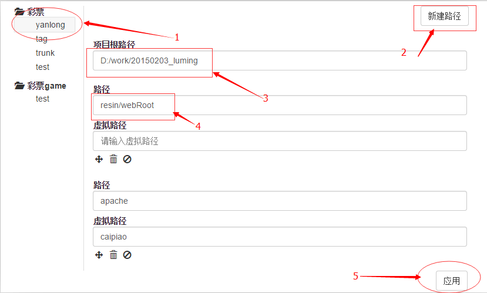
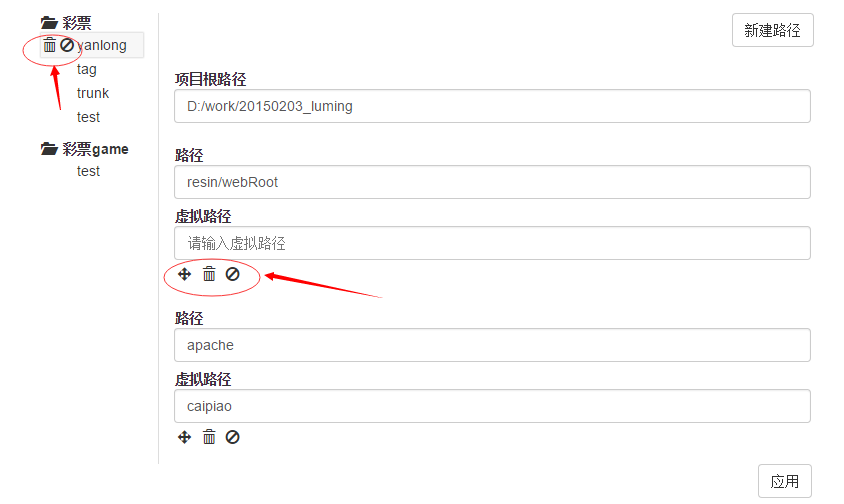

新手引导
------------------------

## 第一步 

>从后台管理看到如下界面

>点击新建分组功能新建一个分组

## 第二步

>在弹窗中写入分组的名称

>点击确定关闭弹窗

## 第三步

>点击新建分支弹窗

>选择一个分组或者新建一个分组

>写入分支名称

>点击确定

##第四部

>可以看到上面的步骤会生成一个左侧的菜单

>分组表示大类别，分支表示当前的一个项目

>点击一个分支

>然后点击新建路径，产生项目的一个路径

>在项目跟路径中填入项目的跟路径

>在路径中填入相对路径

>在虚拟路径中填入虚拟的路径，即不是真实的磁盘路径，而是部分虚拟的路径,系统会自动将虚拟路径与实际路径合并

>点击应用，或者用快捷键ctrl + S

>这个时候浏览器访问就可以了

##第五部 多个分组，分支的处理

>鼠标悬浮到分组或者分支上可以看到2个按钮，分别表示删除和禁止使用

>点击删除将删除分组或者分支，点击禁止使用将禁止使用分支，或者分组

>右侧每个分支的每个路径也可以删除或者禁止使用

>**注意每个操作结束后必须点击保存或者ctrl + S，才能生效**

>**注意路径的执行顺序，谁在最上面谁就先匹配先执行，如果路径冲突，建议禁用其中暂时不用的路径**

>左侧分支和分组可以拖动排序,通过拖动排序改变优先级

>右侧每个分支的路径也可以通过拖动排序改变优先级

>1.4版本以上 双击某个分支，可以直接切换到该分支，并且禁用其他分支

##最后在说点

>每个项目的根路径下可以有个配置文件 run.config.js

>该配置文件 拥有动态修改url地址，切换freemarker jar包版本，配置命令功能

>具体使用请 查看 ftl-node -h
